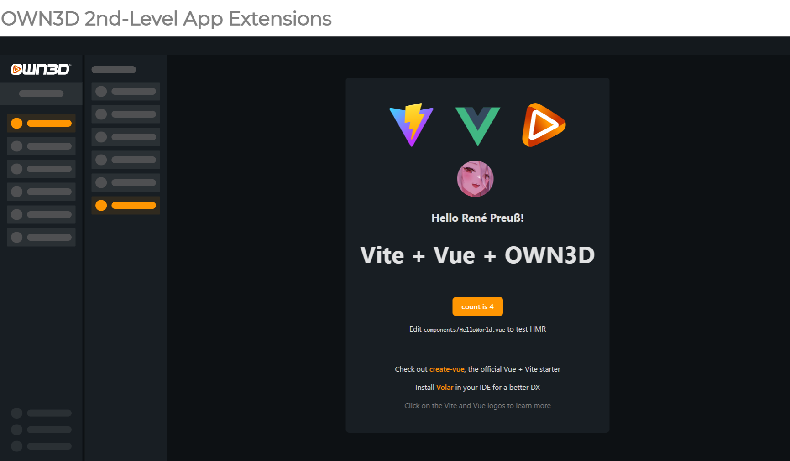

# Designing Extensions <Badge text="closed beta" type="warning"/>

OWN3D Extensions are a key part of the OWN3D platform, providing users with new and engaging ways to interact with the
content they love. As a developer, it's important to make sure your OWN3D Extension is well designed and user-friendly
to maximize its impact.

Here are some tips for designing your OWN3D Extension:

## Color Guidelines

When selecting colors for your OWN3D Extension, it's important to choose a palette that fits the theme and style of your
and our app. Consider using the following guidelines when selecting your colors:

- We recommend you to stick to our colors within the app.

- Use a limited color palette to ensure a cohesive and polished look.

- Choose colors that contrast well with each other to make important elements stand out.

- Consider using the brand colors from OWN3D to ensure consistency with the platform.

## App Discovery Guidelines

To get your OWN3D Extension discovered by users, it's important to make sure it is easy to find and understand. Consider
the following guidelines when designing your app discovery experience:

- Use clear and concise descriptions of your app's functionality and purpose.

- Use screenshots and videos to showcase your app's features and benefits.

- Make sure your app is listed in the appropriate categories to reach the right audience.

Sizes and formats of screenshots and other materials:

- Screenshots: 1024x768px and in .png or .jpg format
- Discovery Image: 500x250px, and in .png or .jpg format (no transparency)
- Icon: 40x40px, and in .png or .jpg format

## UI Recommendations

When designing the user interface (UI) for your OWN3D Extension, it's important to consider the following
recommendations:

- You are supporting light vs. dark mode.

- Keep the UI simple and clean, with clear and concise text labels.

- Make sure the UI is responsive and works well on all screen sizes.

- Consider using a grid-based layout to ensure a consistent and organized look.

By following these guidelines, you can ensure that your OWN3D Extension is well designed, user-friendly, and easy to
discover. Happy designing!

## Forms and Input Fields

When designing forms and input fields for your Scene Editor Widget Extension, it's important to consider the following
recommendations:

- Use the configuration page to allow users to customize unrelated settings.

- Use English as the default language for all text labels and descriptions. We will translate Form labels and
  descriptions into other languages. If you want to provide translations for your app, please contact us.

- Do not use forms and input fields for any sensitive information. This includes, but is not limited to, passwords,
  credit card numbers, social security numbers, and other personally identifiable information, etc.