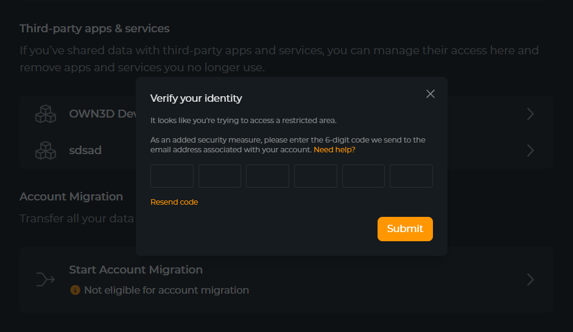

# ID API Reference

## Table of Contents

[[toc]]

## Base URL

The base URL for the ID API is `https://id.stream.tv/api/`.

## API Reference

### Get User

Gets the current authenticated user.

```http
GET https://id.stream.tv/api/users/@me
```

### Get User Connections

Gets the current authenticated user's connections.

```http
GET https://id.stream.tv/api/users/@me/connections
```

### Update Email

Updates the current authenticated user's email.

```http
POST https://id.stream.tv/api/users/@me/update-email
```

### Associate Password

Only for shadow accounts.

Associates a password with the current authenticated user.

```http
POST https://id.stream.tv/api/users/@me/associate-password
```

## Elevated Access Tokens

::: warning
This feature is currently in public beta and may change in the future.
:::



An Elevated Access Token (EAT) is a special type of access token that grants access to certain resources that are not
available to regular access tokens. EATs are used to perform administrative tasks, such as managing your security
settings like 2-Step Verification, YubiKeys, and recovery options.

### Request a Verification Code

To request an Elevated Access Token, you must first authenticate with the ID API using your regular access token. Once
you have authenticated, you can request a one-time verification code that you can use to exchange for an EAT. To request
a verification code, send a `POST` request to the `/api/eat/request-verification` endpoint:

```http
POST https://id.stream.tv/api/eat/request-verification
```

### Exchange Verification Code for EAT

Once you have requested a verification code, you can exchange it for an Elevated Access Token. To exchange the
verification code for an EAT, send a `POST` request to the `/api/eat/verify-code` endpoint:

```http
POST https://id.stream.tv/api/eat/verify-code
Content-Type: application/json

{
  "code": "your_verification_code"
}
```

### Handling EAT in Backend APIs

Once you have exchanged your verification code for an EAT, you can use it to perform administrative tasks in OWN3D
Backend APIs that require elevated access. To use an EAT in your backend APIs, you need to include it in
the `Elevated-Access-Token` header of your requests. Here is an example of how you can use an EAT in your API requests:

```http
GET https://example.com/api/admin
Authorization: Bearer <your_access_token>
Elevated-Access-Token: <your_eat>
```

**Verify EAT in Backend APIs**

The OWN3D Backend APIs themselves use the ID API to verify EATs. To verify an EAT in your backend API, you need to send
a `GET` request to the `/api/eat/verify` endpoint with the EAT included in the `Elevated-Access-Token` header:

```http
GET https://id.stream.tv/api/eat/verify
Authorization: Bearer <your_access_token>
Elevated-Access-Token: <your_eat>
```

If the EAT is valid, the API will return a `200 OK` response. If the EAT is invalid or expired, the API will return a
`401 Unauthorized` response.

### Store EAT in Local Storage

It is recommended to store your EAT in local storage for future use. Just make sure to keep it secure and never share it
with anyone. You need to store at least the `id`, `user_id` and `expires_at` fields. Here is an example of how you can
store your EAT in local storage:

```javascript
const { data } = await axios.post('/api/eat/verify-code', { code: 'your_verification_code' })
localStorage.setItem('eat', JSON.stringify(data))
```

### EAT Expiration

Elevated Access Tokens expire after a certain period of time. To avoid form submission errors, you should renew your EAT
before it expires. The recommended time to renew your EAT is 5 minutes before it expires.
